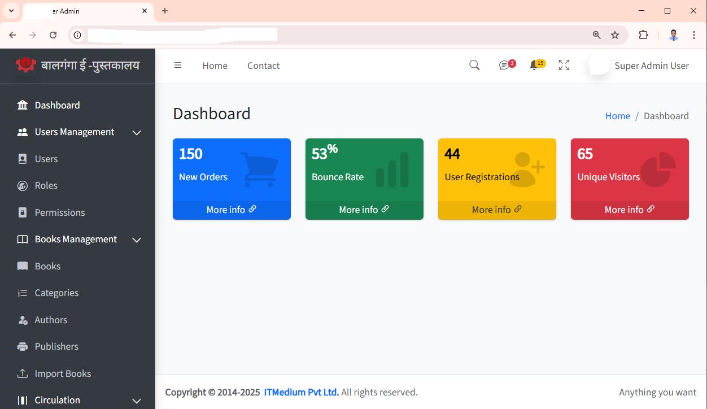
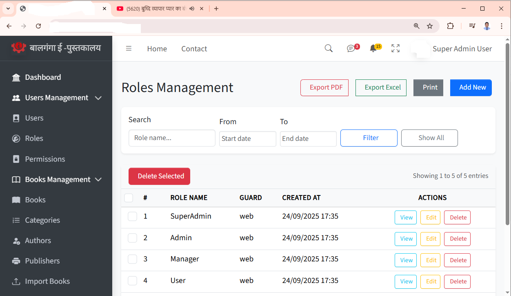
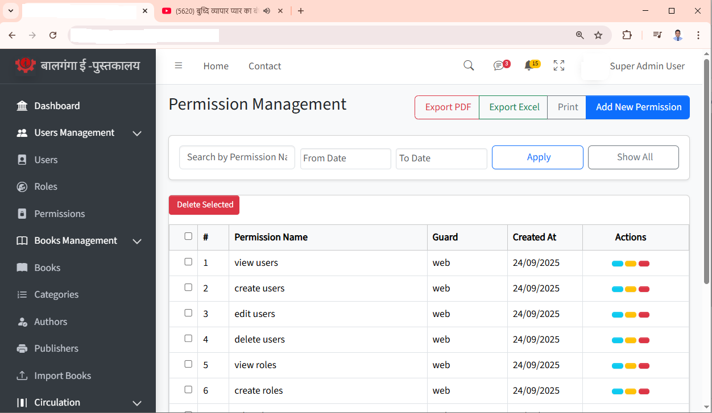
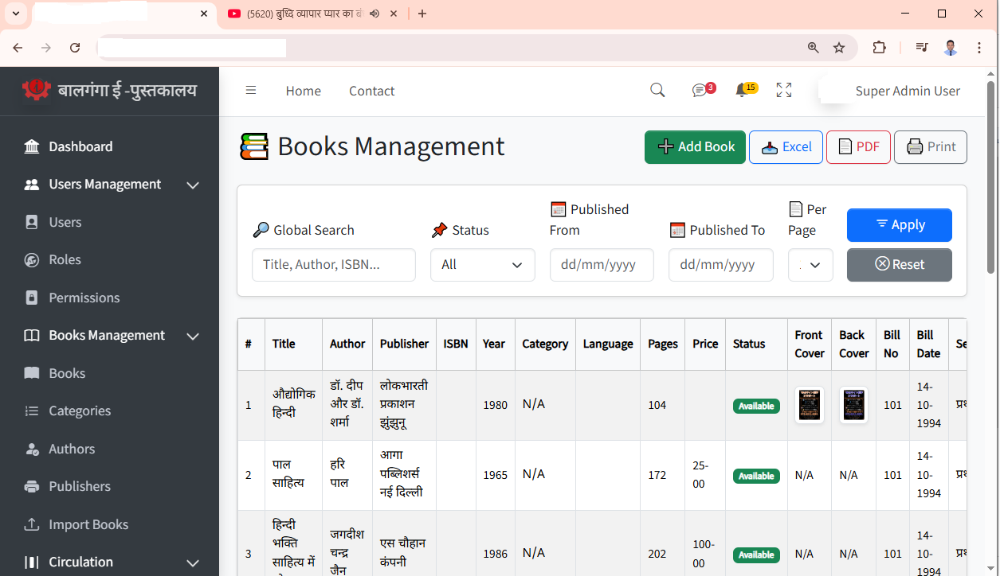
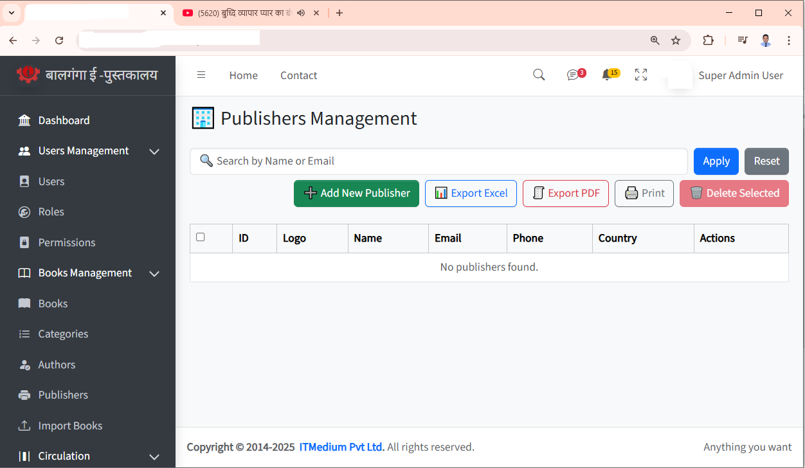

# Enterprise Resource & Library Management Platform

## 📌 Overview

A scalable, enterprise-grade management system designed to streamline library operations, inventory tracking, and user administration within organizations.

The platform centralizes multiple operational modules into a unified system, improving efficiency, visibility, and data-driven decision-making.

---

## 🚀 Key Features

### 🔐 User & Role Management

* Role-Based Access Control (RBAC)
* User, Role, and Permission management
* Secure authentication & authorization

### 📚 Library Management

* Book catalog management (Books, Categories, Authors, Publishers)
* Book issue & return lifecycle
* Member (Student/User) management

### 📦 Inventory Management

* Stock and category management
* Lost & damaged item tracking
* Purchase request workflow

### 🔄 Circulation System

* Book issue/return tracking
* Due date and fine handling

### 📊 Reports & Analytics

* Dashboard with real-time statistics
* Borrowing trends and activity insights

---

## 🏗️ Architecture

* **Architecture Style:** Modular Monolithic (Microservices-ready)
* **Pattern:** MVC (Model-View-Controller)

### Tech Stack:

* **Backend:** PHP (Laravel)
* **Frontend:** Blade, Bootstrap, JavaScript
* **Database:** MySQL
* **Version Control:** Git / GitHub

---

## 🧠 Design Highlights

* Modular structure for scalability and maintainability
* RBAC implementation for secure multi-user environment
* Optimized relational database design
* Clean separation of business logic and presentation layer

---

## 📸 System Screenshots

### 🏠 Dashboard

### 👥 User & Role Management

### 📚 Library Management

### 👨‍🎓 Member Management

### 📦 Inventory Management

---

## 💼 Business Value

* Automates manual workflows
* Improves operational efficiency
* Provides real-time visibility into system data
* Supports multi-role organizational structure

---

## 📈 Future Enhancements

* Microservices architecture migration
* REST API for frontend/backend decoupling
* Cloud deployment (AWS / Azure)
* Advanced analytics and reporting

---

## 👨‍💻 Author

**Manoj Prasad**
Full Stack Engineer | Backend Specialist
📍 Based in Japan

